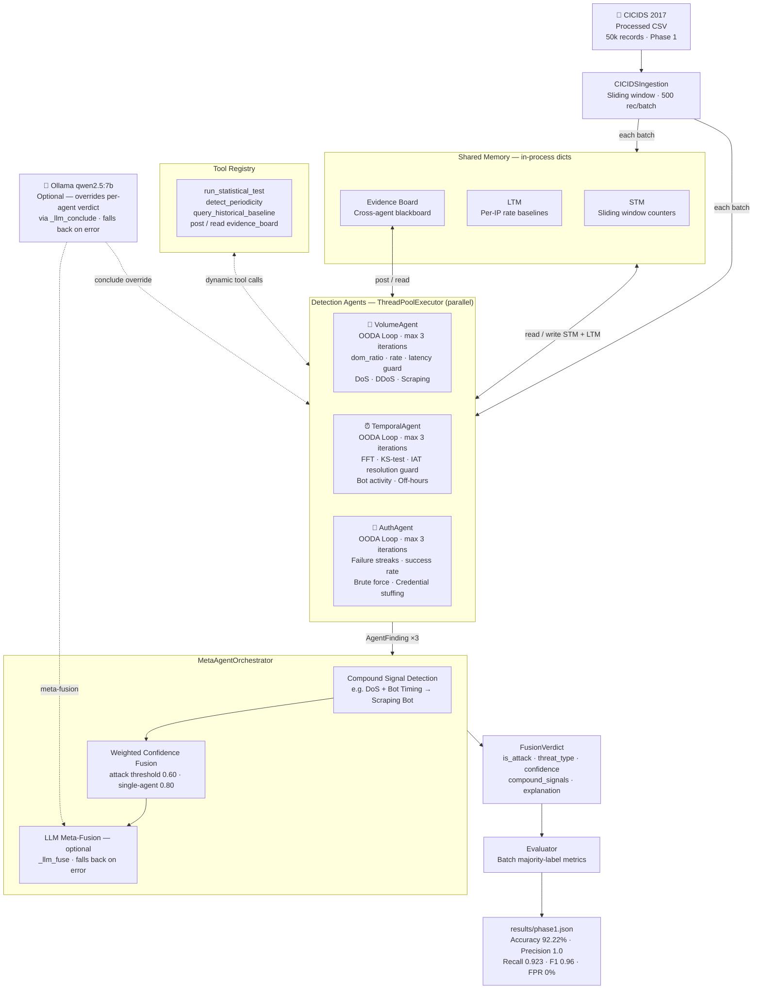
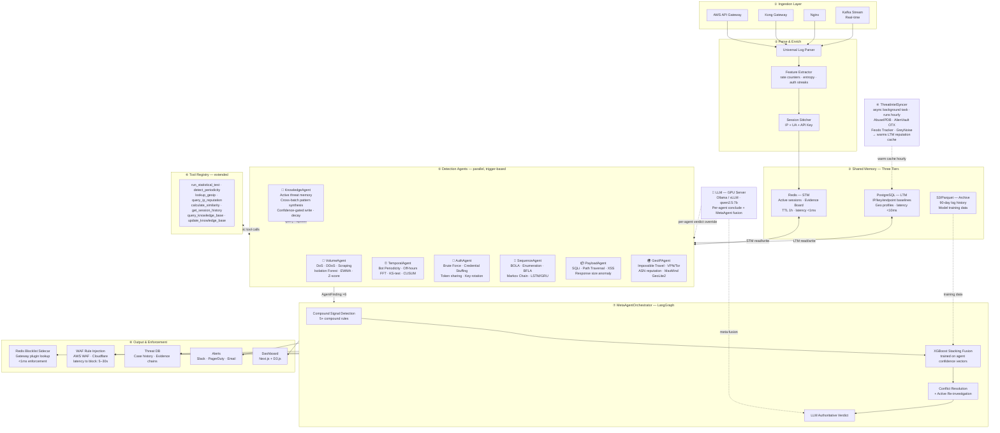

> For LLM reading: This is the always-up-to-date implementation + architecture reference. Keep `NOTES.md` separate. `ARCHITECTURE.md` has been consolidated here and can be deleted.

---

## Project Overview

**Name:** APISentry  
**Goal:** IEEE paper → B2B SaaS. Multi-agent API abuse detection from gateway logs only (zero inline proxy).  
**Phase 1 target:** Volume + Temporal + Auth agents + MetaOrchestrator on CICIDS 2017, then expand.  
**Python:** 3.11.14 (`.venv/`)

---

## Directory Structure

```
abuse-engine/
├── datasets/
│   ├── CICIDS2017/          # raw CSVs
│   ├── CICIDS2017-ML/       # ML-ready CSVs
│   └── processed/           # cicids2017_api_logs.csv (API-normalised)
├── engine/
│   ├── agents/              # VolumeAgent, TemporalAgent, AuthAgent, BaseAgent
│   ├── coordinator/         # MetaAgentOrchestrator
│   ├── ingestion/           # CICIDSIngestion
│   ├── llm/                 # LLMClient, prompts (Ollama / OpenAI-compatible)
│   ├── memory/              # SharedMemory (STM + LTM + EvidenceBoard)
│   ├── normalization/       # (stub, future)
│   ├── pipeline/            # (stub, future)
│   ├── tests/               # run_tests.py — 32 tests, no pytest needed
│   └── tools/               # ToolRegistry
├── evaluation/              # Evaluator (batch-level majority-label metrics)
├── results/                 # phase1_fixed.json, phase1_llm.json …
├── schemas/                 # models.py — Pydantic schemas
├── scripts/                 # prepare_cicids_dataset.py
├── main.py                  # CLI entry point
└── requirements.txt
```

---

## Dataset — CICIDS 2017

**Processed:** 2.83M records → `datasets/processed/cicids2017_api_logs.csv`  
**Phase 1 evaluation:** first 50k records (100 batches × 500)

**Class distribution (full dataset):**
| Category | Count |
|---|---|
| Benign | 2,273,097 |
| DoS | 380,688 |
| Port Scan | 158,930 |
| Brute Force | 15,342 |
| Botnet | 1,966 |
| Web Attack | 673 |
| Infiltration | 36 |
| Heartbleed | 11 |

**Synthesised fields** (not in original CICIDS):
| Field | Source |
|---|---|
| `timestamp` | Original col → ISO format |
| `ip` | Source IP |
| `method` | Constant `"GET"` |
| `endpoint` | Dest port → `/port_<port>` |
| `status` | 200; Brute Force → random 200/401/403 |
| `response_size` | Total forward packets (0 if missing) |
| `latency` | Flow duration µs→ms, clipped 10 000ms |
| `user_agent` | `""` |
| `attack_category` | Mapped from label |
| `is_attack` | True if not Benign |

---

## Architecture

### Diagrams

#### Research Prototype — Phase 1 (current implementation only)



#### Product Vision — Full System (future)



---

### Why Truly Agentic (not a pipeline)

Most "multi-agent" systems are actually multi-model pipelines — fixed features → model → score. APISentry is different:

| Capability | Pipeline ❌ | APISentry ✅ |
|---|---|---|
| Planning | Fixed feature→score | Agent observes anomaly, plans multi-step investigation, adapts |
| Tool Use | Hardcoded extraction | Agent dynamically calls statistical tests, GeoIP, baselines on demand |
| Stateful Autonomy | Stateless per-request | Agent remembers past sessions, builds evolving threat profiles |
| Reasoning Loops | Single forward pass | Observe→Hypothesize→Investigate→Revise→Conclude (iterative) |
| Inter-Agent Comms | Scores passed to ensemble | Agents challenge each other's findings via Evidence Board |
| Self-Reflection | No error awareness | Agent evaluates its own confidence, requests more data when uncertain |

### OODA Reasoning Loop (every agent)

```
① OBSERVE    → Ingest new log batch
② ORIENT     → Compare against baselines and historical patterns
③ HYPOTHESIZE→ Form candidate threat hypothesis
④ INVESTIGATE→ Call tools to gather evidence (stats tests, baseline queries, evidence board)
⑤ EVALUATE  → Evidence supports hypothesis?
                YES (high conf) → ⑥  |  PARTIAL → revise → ③  |  NO → new hypothesis → ③
⑥ CONCLUDE  → Emit AgentFinding with evidence chain and confidence score
```
Loop runs up to `MAX_ITERATIONS=3`. LLM override fires once after ⑥ if `llm_client` is wired in.

### Production Data Flow (future)

```
Raw gateway log (Nginx/Kong/AWS Gateway)
  → ① Universal Parser + Feature Extractor + Session Stitcher
  → ② Short-Term Memory (Redis, active sessions)
  → ③ Agents activate (trigger-based, parallel):
        VolumeAgent    : rate > 2σ
        TemporalAgent  : timing anomaly or off-hours
        AuthAgent      : any 401/403
        SequenceAgent  : every new request in session
        PayloadAgent   : unusual query/param patterns
        GeoIPAgent     : new IP or geo deviation
  → ④ Agents run OODA loops with tools → post to Evidence Board
  → ⑤ MetaAgent fuses → Final Verdict {threat_score, category, severity, action}
```

### Memory — Three Tiers

```
TIER 1 — Short-Term Memory  (Redis, prod) / in-process dict (current)
  Active session states (TTL: 1h), sliding window counters,
  current investigation state per agent, Evidence Board
  Latency: <1ms | Updated: every batch

TIER 2 — Working Memory  (PostgreSQL, prod) / in-process dict (current)
  Per-IP/key/endpoint baselines, learned workflow sequences,
  geographic profiles per API key, past investigation outcomes
  Latency: <10ms | Updated: hourly

TIER 3 — Long-Term Memory  (S3/Parquet, prod) / not yet implemented
  Historical log archives (90 days), model training snapshots,
  threat intelligence snapshots, agent performance metrics
  Latency: seconds | Updated: daily
```

### Tool Registry (`engine/tools/registry.py`)

Agents call `ToolRegistry.call(tool_name, **kwargs)` dynamically during `investigate()`.

**Currently implemented:**
- `run_statistical_test` — z-score, KS-test, proportions
- `detect_periodicity` — FFT + autocorrelation
- `query_historical_baseline`
- `post_to_evidence_board` / `read_evidence_board`

**Planned (Phase 2):**
- `lookup_geoip` → MaxMind GeoLite2
- `query_ip_reputation` → reads local cache warmed by ThreatIntelSyncer
- `get_session_history`
- `calculate_similarity` — edit distance / DTW for sequence comparison
- `query_knowledge_base` / `update_knowledge_base` → KnowledgeAgent interface

### Detection Agents (Phase 1 — implemented)

**VolumeAgent** — DoS / DDoS / scraping  
Thresholds: `DOMINANT_IP_RATIO=0.90`, `HIGH_RATE_ABSOLUTE=450`, `HIGH_LATENCY_BENIGN_MS=6500`, `WARMUP_BATCHES=10`, `MAX_IP_DIVERSITY=5`  
Logic: dominant IP ratio + absolute rate + per-IP LTM baseline + latency guard (single-IP benign sessions have avg_latency > 6500ms)

**TemporalAgent** — bot periodicity + off-hours  
Thresholds: `BOT_CONFIDENCE_THRESHOLD=0.85`, `MIN_PERIODIC_IPS=2`, `MIN_IAT_RESOLUTION_MS=500`  
Logic: FFT/KS-test on inter-arrival times; skips if median IAT < 500ms (CICIDS 1-second timestamp resolution guard)

**AuthAgent** — credential stuffing + brute force  
Logic: consecutive 401/403 streaks ≥10 → brute force; success rate 1–8% with ≥20 attempts → credential stuffing; failure ratio >80%  
Realistic baselines: normal 1–2 failures/hour; stuffing 50–500 failures/min with ~2–5% success; token sharing = same key from 10+ IPs in 1 hour

### Planned Agents (Phase 2 — research)

**Sequence Analysis Agent** — BOLA, enumeration, workflow abuse, BFLA  
Patterns: sequential integer param walks (`/users/1001 → 1002 → 1003`), workflow bypass (skip cart→payment), role-inappropriate endpoints, shadow API probing  
Models: Markov Chain transitions, LSTM/GRU, N-gram frequency

**Payload Fingerprint Agent** — URL-visible injection signals, response size anomaly  
Constraint: log-only mode means no request body — works on query string, path params, request/response size correlation  
Patterns: SQLi in URL params, path traversal, response size spike (2KB→85KB = data exfiltration)

**Geo-IP Intelligence Agent** — impossible travel, VPN/Tor/datacenter, ASN reputation  
Sources: MaxMind GeoLite2 (free), Tor exit list (public hourly), known cloud IP ranges  
Example signal: same API key from Mumbai at 13:00 and Moscow at 13:04 (8.5h travel required)

### MetaAgentOrchestrator (`engine/coordinator/meta_agent.py`)

1. Dispatches all agents in parallel (ThreadPoolExecutor)
2. Reads consolidated Evidence Board
3. Detects compound signals — e.g. DoS + Bot Timing → Scraping Bot; Auth + Geo + Vol → Credential Stuffing
4. Weighted confidence fusion (`_ATTACK_THRESHOLD=0.60`, `_SINGLE_AGENT_THRESHOLD=0.80`)
5. Optional LLM meta-fusion (Step 4, only if `llm_client` provided)

**MetaAgent agentic behaviours (not just averaging):**
- When individual agents are all sub-threshold, MetaAgent can request re-analysis at wider window
- Conflict resolution: Auth=NONE + Sequence=BOLA → escalates (BOLA with valid creds is *more* dangerous)
- Compound signals boosted only when each contributing agent independently meets `min_conf` threshold

**Fusion strategy:** weighted average (current, interpretable). XGBoost stacking is the paper target for higher accuracy.

### LLM Integration (`engine/llm/`)

- `client.py` — `LLMClient`: thin wrapper around any OpenAI-compatible endpoint. `reason(system, user) → dict`. JSON fallback parsing.
- `prompts.py` — per-agent system prompts + `META_SYSTEM_PROMPT`; `build_agent_user_prompt()` / `build_meta_user_prompt()`
- **Target model:** Ollama + `qwen2.5:7b` at `http://localhost:11434/v1` (institute GPU server)
- **Per-agent:** after rule-based conclude, `_llm_conclude()` overrides finding. Falls back to rules on error.
- **MetaAgent:** after rule-based fusion, `_llm_fuse()` provides final authoritative verdict. Falls back on error.
- **Backward-compatible:** omit `--llm-url` → pure rule-based, zero latency added

---

## Current Metrics (Phase 1, 50k records, rule-based)

| Metric | Value |
|---|---|
| Accuracy | 92.22% |
| Precision | 1.0000 |
| Recall | 0.9231 |
| F1 | 0.9600 |
| FPR | 0% |
| False Positives | 0 |
| False Negatives | 6 |
| Test suite | 32/32 passing ✅ |

Precision=1.0 is intentional — thresholds are conservative (never false-alarm). The 6 FNs are DoS batches that fall below threshold.

---

## Running the System

**Rule-based only:**
```bash
python main.py \
  --data datasets/processed/ \
  --window 500 --max-records 50000 \
  --output results/phase1_fixed.json \
  --warmup-batches 10
```

**With local LLM (Ollama):**
```bash
# Install once
curl -fsSL https://ollama.com/install.sh | sh
ollama pull qwen2.5:7b

# Run
python main.py \
  --data datasets/processed/ \
  --window 500 --max-records 50000 \
  --output results/phase1_llm.json \
  --warmup-batches 10 \
  --llm-url http://localhost:11434/v1 \
  --llm-model qwen2.5:7b
```

**Tests:**
```bash
python -m engine.tests.run_tests
```

---

## OWASP API Top 10 Coverage

| Risk | Status | Agent |
|---|---|---|
| API1: BOLA | ⏳ Phase 2 | Sequence |
| API2: Broken Auth | ✅ Live | Auth |
| API3: Object Property Auth | ⏳ Phase 2 | Payload |
| API4: Resource Consumption | ✅ Live | Volume |
| API5: BFLA | ⏳ Phase 2 | Sequence |
| API6: Unrestricted Flows | ⏳ Phase 2 | Sequence |
| API7: SSRF | ⏳ Phase 2 | Payload |
| API8: Misconfiguration | ⏳ Phase 2 | General |
| API9: Inventory Mgmt | ⏳ Phase 2 | Sequence |
| API10: Unsafe Consumption | ❌ N/A | Requires code analysis |

**Phase 1 live: 2/10. Full target: 6/10.**

---

## Tech Stack

| Component | Research / current | Production (future) |
|---|---|---|
| Agents | Python + rule-based + LLM | Same + scikit-learn / PyTorch models |
| Memory | In-process dicts | Redis (STM) + PostgreSQL (LTM) + S3 (archive) |
| Orchestrator | Python ThreadPool + LLM | LangGraph |
| LLM | Ollama / any OpenAI-compat | Same |
| Sequence Models | (not yet) | PyTorch LSTM/GRU |
| Ingestion | Pandas CSV batch | Kafka + Apache Flink (streaming) |
| Evaluation | Custom batch majority-label | + AUC-ROC, per-attack-type, latency benchmarks |
| IP Enrichment | (not yet) | MaxMind GeoLite2 (`geoip2` pkg) |
| Dashboard | (not yet) | Next.js + D3.js |
| Infrastructure | Local / institute GPU | AWS (ECS + S3 + Kinesis) |

---

## Production Phase — Roadmap Items

### KnowledgeAgent (active threat memory)
Elevates passive LTM into an active reasoning agent. Sits outside the detection loop — answers queries, doesn't produce verdicts.

**Responsibilities:**
- After each confirmed verdict (conf > 0.85): extract and store attack signatures (IP, timing fingerprint, endpoint pattern, attack type)
- Answer `query_knowledge_base(ip)` calls from other agents during `investigate()` — sub-millisecond (reads local cache, no HTTP)
- Decay old knowledge — time-weighted scoring so stale entries lose influence
- Cross-batch pattern synthesis: "this IP has hit 3 different endpoints across 8 batches, each sub-threshold individually, but collectively damning"

**Ablation paper claim:** active knowledge maintenance improves recall on repeat-offender IPs by measurable X% vs passive LTM baseline.

**Risks:** feedback poisoning (FP stored as ground truth) — mitigated by confidence gate + agreement scoring before writing.

### ThreatIntelSyncer (live feed integration)
Background async process — keeps local caches warm, never called during the detection loop.

**Feeds (all free):**
| Source | Data | Update freq |
|---|---|---|
| AbuseIPDB | Per-IP abuse reports + confidence | On demand (API key, 1k/day free) |
| AlienVault OTX | IP/domain indicators, attack campaigns | Pull hourly |
| Feodo Tracker | C2 botnet IPs (blocklist) | Pull hourly |
| GreyNoise | Internet background noise vs active attackers | Pull hourly |

**Architecture:**
```
ThreatIntelSyncer (asyncio background task, runs every 1h)
  → fetch feeds → write to LTM._ip_reputation_cache + LTM._known_c2_ips
  → agents read cache during investigate() — no HTTP, <1ms

For paper evaluation: pre-fetch snapshots for all CICIDS 2017 IPs
  → replay as static cache → sidesteps live dependency
```

**Paper angle:** ablation with vs without external intel — measure FP reduction and recall gain. Study at what AbuseIPDB confidence threshold external intel helps vs hurts.

---

## IEEE Paper Validation Strategy

Multi-dataset approach (no single labeled API-gateway dataset exists):

| Dataset | Size | Agents validated |
|---|---|---|
| CICIDS 2017 | 2.8M | Volume, Temporal, Auth ✅ |
| CICIDS 2018 | 16M+ | Volume, Temporal, Auth |
| UNSW-NB15 | 2.5M | Volume, Geo-IP, Temporal |
| CSIC 2010/2012 | 61K | Payload, Sequence |

**Ablation study (required for paper):**

| Experiment | Purpose |
|---|---|
| Full system (all agents + LLM + meta) | Best performance baseline |
| −each agent individually | Proves each agent's value |
| No meta-agent (simple average) | Proves meta-agent value |
| No LLM (rule-based only) | Proves LLM adds value |
| No memory (fresh baselines each batch) | Proves memory adds value |
| No inter-agent comms (isolated agents) | Proves Evidence Board adds value |
| No tool use (pre-computed features only) | Proves dynamic tool use adds value |
| Static-only (single-pass, no reasoning loop) | Proves OODA loop adds value |

Expected ordering: Full agentic > No-memory > No-inter-agent > No-tool-use > Static-only

**Key paper claims:**
1. Zero-integration — no code changes by API owners
2. Truly agentic — planning, tool use, stateful autonomy (provable via ablation)
3. Multi-agent fusion outperforms individual agents
4. Inter-agent communication improves ambiguous case resolution
5. 6/10 OWASP API Top 10 coverage from logs alone
6. Agentic behavior adds measurable value vs equivalent pipeline