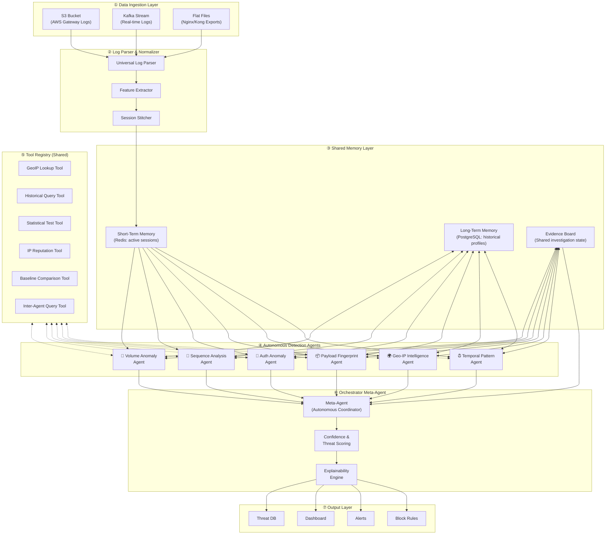
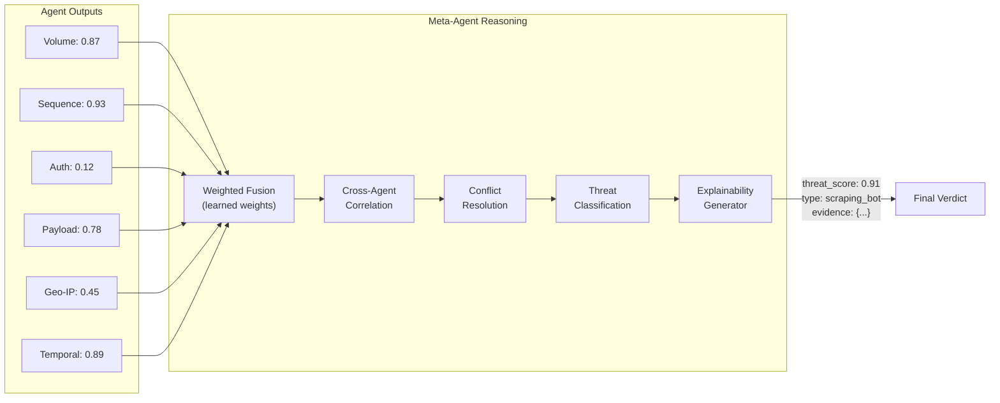
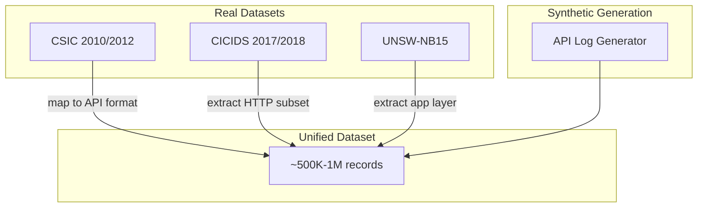

# APISentry: Multi-Agentic API Abuse Detection System — Architecture Design

> **Project Codename:** APISentry  
> **Goal:** IEEE paper validation → B2B SaaS product  
> **Core Differentiator:** Zero-integration, log-only analysis (no inline proxy)  
> **Architecture Philosophy:** True agentic AI — not pipelines, but autonomous reasoning agents

---

## 1. Why "Truly Agentic" — Not Just ML Pipelines

Most "multi-agent" security systems are actually **multi-model pipelines** — they run fixed ML models on fixed features and produce scores. That is NOT agentic AI.

### What Makes Our Agents Genuinely Agentic

| Capability | Pipeline Approach ❌ | Our Agentic Approach ✅ |
|---|---|---|
| **Planning** | Fixed feature → model → score | Agent observes anomaly → plans multi-step investigation → adapts if evidence changes |
| **Tool Use** | Hardcoded feature extraction | Agent dynamically queries GeoIP APIs, pulls historical baselines, runs statistical tests on demand |
| **Stateful Autonomy** | Stateless per-request scoring | Agent maintains investigation state, remembers past sessions, builds evolving threat profiles |
| **Reasoning Loops** | Single forward pass | Observe → Hypothesize → Investigate → Revise → Conclude (iterative) |
| **Inter-Agent Communication** | Scores passed to ensemble | Agents request evidence from each other, challenge findings, collaborate on ambiguous cases |
| **Self-Reflection** | No error awareness | Agent evaluates its own confidence, requests more data when uncertain, flags own limitations |

### The Agentic Reasoning Loop (Every Agent Follows This)

```
┌─────────────────────────────────────────────────────┐
│                 AGENT REASONING LOOP                │
│                                                     │
│  ① OBSERVE    → Ingest new log batch / alert        │
│       │                                             │
│  ② ORIENT     → Compare against known baselines     │
│       │          and historical patterns             │
│       │                                             │
│  ③ HYPOTHESIZE→ "This looks like credential         │
│       │          stuffing because..."                │
│       │                                             │
│  ④ INVESTIGATE→ Use tools to gather evidence:       │
│       │          - Query historical DB               │
│       │          - Call GeoIP API                    │
│       │          - Run statistical test              │
│       │          - Ask another agent for input       │
│       │                                             │
│  ⑤ EVALUATE   → Does evidence support hypothesis?   │
│       │          - YES (high confidence) → ⑥         │
│       │          - PARTIAL → revise hypothesis → ③   │
│       │          - NO → generate new hypothesis → ③  │
│       │          - INSUFFICIENT DATA → request       │
│       │            more context → ④                  │
│       │                                             │
│  ⑥ CONCLUDE   → Emit verdict with evidence chain    │
│                  and confidence score                │
└─────────────────────────────────────────────────────┘
```

This is the **OODA-inspired loop** (Observe-Orient-Decide-Act) that makes each agent a genuine reasoning entity, not a function call.

---

## 2. High-Level System Architecture



### What Changed From a Basic Pipeline Architecture

1. **Shared Memory Layer** — Agents have STM (active investigations) and LTM (learned baselines). They don't just process data; they *remember*.
2. **Evidence Board** — A shared blackboard where agents post findings other agents can consume. The Geo-IP agent posts "this IP is from a datacenter" and the Volume agent reads it to contextualize a rate spike.
3. **Tool Registry** — Agents don't have hardcoded logic. They have *tools* they can invoke dynamically during their reasoning loop.
4. **Bidirectional arrows** — Agents read from AND write to memory. They update their own baselines. They learn.

---

## 3. Realistic Log Fields — What You Actually Get in Production

> **CRITICAL:** Since this is a **log-only** system, we are constrained to what the gateway writes. We do **NOT** have access to request/response bodies in most default configurations. This shapes which attacks we can detect.

### 3.1 AWS API Gateway (Access Logs — CLF/JSON)

| Field | Example | Abuse Signal |
|---|---|---|
| `requestTime` | `2026-04-01T13:22:01Z` | Temporal patterns |
| `ip` | `103.21.244.15` | IP reputation, geo, volume |
| `httpMethod` | `GET`, `POST`, `DELETE` | Method abuse |
| `resourcePath` | `/api/v2/users/{id}` | Enumeration, BOLA |
| `path` | `/api/v2/users/48291` | Parameter values reveal enumeration |
| `status` | `200`, `401`, `403`, `429` | Auth failures, rate limiting |
| `protocol` | `HTTP/1.1` | Bot fingerprinting |
| `responseLength` | `4521` | Data exfiltration signal |
| `requestTime` (latency) | `245` ms | Injection / heavy queries |
| `caller` / `user` | `arn:aws:iam::...` | Identity tracking |
| `apiKeyId` | `a1b2c3d4e5` | Per-key abuse |
| `stage` | `prod`, `staging` | Environment targeting |
| `integrationLatency` | `190` ms | Backend stress indicator |
| `wafRuleId` *(if WAF enabled)* | `AWS-AWSManagedRules...` | Pre-flagged threats |

### 3.2 Kong Gateway (Log Serializer)

| Field | Example | Abuse Signal |
|---|---|---|
| `client_ip` | `198.51.100.42` | Same as above |
| `started_at` | `1711972921000` | Unix ms timestamp |
| `request.method` | `PATCH` | Method anomaly |
| `request.uri` | `/api/orders/99201` | Enumeration |
| `request.headers.user-agent` | `python-requests/2.28` | Bot fingerprint |
| `request.headers.authorization` | `Bearer eyJhb...` | Token reuse detection |
| `request.size` | `1024` | Payload size anomaly |
| `response.status` | `200` | Success/failure ratio |
| `response.size` | `89210` | Large response = data leak |
| `latencies.kong` | `3` ms | Gateway overhead |
| `latencies.proxy` | `540` ms | Backend latency (injection?) |
| `latencies.request` | `543` ms | Total latency |
| `route.paths` | `["/api/orders"]` | Route-level analysis |
| `consumer.username` | `partner_app_x` | Consumer-level tracking |
| `authenticated_groups` | `["tier-1"]` | Privilege escalation |

### 3.3 Nginx (Combined/Custom Log Format)

| Field | Example | Abuse Signal |
|---|---|---|
| `$remote_addr` | `45.33.32.156` | IP tracking |
| `$time_local` | `01/Apr/2026:13:22:01 +0000` | Temporal |
| `$request` | `GET /api/v1/search?q=admin HTTP/1.1` | Full request line |
| `$status` | `200` | Response code |
| `$body_bytes_sent` | `12045` | Response size |
| `$http_referer` | `https://app.example.com` | Referrer validation |
| `$http_user_agent` | `Mozilla/5.0...` | UA fingerprint |
| `$http_x_forwarded_for` | `203.0.113.50, 70.41.3.18` | Proxy chain |
| `$upstream_response_time` | `0.251` | Backend latency |
| `$request_time` | `0.254` | Total request time |
| `$ssl_protocol` | `TLSv1.3` | TLS fingerprint |
| `$request_length` | `487` | Request size |

### 3.4 Derived / Enriched Fields (Computed by Our Pipeline)

| Derived Field | Source | How |
|---|---|---|
| `geo_country`, `geo_city`, `geo_asn` | `client_ip` | MaxMind GeoIP2 lookup |
| `is_vpn`, `is_tor`, `is_datacenter` | `client_ip` | IP intelligence DB |
| `session_id` | IP + UA + API key | Session stitching heuristic |
| `endpoint_template` | `/api/users/48291` → `/api/users/{id}` | Regex normalization |
| `request_rate_1m`, `_5m`, `_15m` | timestamp + session | Sliding window counters |
| `sequential_endpoints` | session + timestamp sort | Ordered endpoint sequence |
| `auth_failure_streak` | status codes per session | Consecutive 401/403 count |
| `response_size_zscore` | response size per endpoint | Statistical anomaly |
| `hour_of_day`, `day_of_week` | timestamp | Temporal features |
| `param_entropy` | query string / path params | Randomness of parameter values |

---

## 4. The Agent Tool System — What Makes Them Agentic

Each agent has access to a **Tool Registry** — a set of callable functions it can invoke during its reasoning loop. The agent *decides* which tools to use and when, based on its current hypothesis. This is the core difference from a pipeline.

### 4.1 Tool Registry

```python
class ToolRegistry:
    """Central registry of tools available to all agents.
    Each agent can invoke any tool dynamically during investigation."""
    
    tools = {
        # ── Data Retrieval Tools ──────────────────────────────────
        "query_historical_baseline": {
            "description": "Get historical baseline metrics for an endpoint/IP/session",
            "inputs": ["entity_type", "entity_id", "metric", "time_range"],
            "returns": "BaselineStats(mean, std, p50, p95, p99, sample_count)"
        },
        "lookup_geoip": {
            "description": "Resolve IP address to geographic + ASN information",
            "inputs": ["ip_address"],
            "returns": "GeoResult(country, city, asn, org, is_vpn, is_tor, is_datacenter)"
        },
        "query_ip_reputation": {
            "description": "Check IP against known abuse databases",
            "inputs": ["ip_address"],
            "returns": "ReputationScore(abuse_score, categories, last_reported, reports_count)"
        },
        "get_session_history": {
            "description": "Retrieve full request history for a session",
            "inputs": ["session_id", "time_range"],
            "returns": "List[NormalizedLogRecord]"
        },
        
        # ── Analysis Tools ────────────────────────────────────────
        "run_statistical_test": {
            "description": "Run a statistical test on a data series",
            "inputs": ["test_type", "data", "parameters"],
            "returns": "TestResult(statistic, p_value, is_significant, interpretation)"
            # test_type: z_test, chi_squared, kolmogorov_smirnov, 
            #            mann_whitney, autocorrelation, fft
        },
        "compute_entropy": {
            "description": "Calculate Shannon entropy of parameter values",
            "inputs": ["values"],
            "returns": "EntropyResult(entropy, max_entropy, normalized_entropy)"
        },
        "detect_periodicity": {
            "description": "Run FFT/autocorrelation to find periodic patterns",
            "inputs": ["timestamps"],
            "returns": "PeriodicityResult(dominant_frequency, strength, is_periodic)"
        },
        "calculate_similarity": {
            "description": "Compare two sequences for similarity (edit distance, DTW)",
            "inputs": ["sequence_a", "sequence_b", "method"],
            "returns": "SimilarityResult(score, alignment, interpretation)"
        },
        
        # ── Inter-Agent Communication Tools ───────────────────────
        "query_agent": {
            "description": "Ask another agent for its assessment of a session/entity",
            "inputs": ["target_agent", "question", "context"],
            "returns": "AgentResponse(assessment, confidence, evidence)"
        },
        "post_to_evidence_board": {
            "description": "Share a finding on the shared evidence board",
            "inputs": ["finding_type", "entity_id", "evidence"],
            "returns": "posted_id"
        },
        "read_evidence_board": {
            "description": "Check if other agents have posted relevant findings",
            "inputs": ["entity_id", "finding_types"],
            "returns": "List[Evidence]"
        },
        
        # ── Memory Tools ──────────────────────────────────────────
        "update_baseline": {
            "description": "Update learned baseline for an entity (self-improvement)",
            "inputs": ["entity_type", "entity_id", "new_observations"],
            "returns": "UpdatedBaseline"
        },
        "store_investigation": {
            "description": "Save investigation state for continuation",
            "inputs": ["investigation_id", "state"],
            "returns": "stored_id"
        }
    }
```

### 4.2 Example: Auth Agent Full Investigation Trace

This shows the **actual reasoning trace** — not a pipeline, but a thinking, investigating entity:

```
╔══════════════════════════════════════════════════════════════════════╗
║  AUTH AGENT — Investigation Trace for session sess_m4n5o6           ║
╠══════════════════════════════════════════════════════════════════════╣
║                                                                    ║
║  STEP 1: OBSERVE                                                   ║
║  → Received batch: 247 auth failures in 10 min from IP 198.51.100  ║
║  → Initial signal: auth_failure_rate = 24.7/min (very high)        ║
║                                                                    ║
║  STEP 2: HYPOTHESIZE                                               ║
║  → Hypothesis A: Credential stuffing attack                        ║
║  → Hypothesis B: Misconfigured client retrying with bad token      ║
║  → Hypothesis C: Token expiry cascade (legitimate, mass logout)    ║
║                                                                    ║
║  STEP 3: INVESTIGATE (Tool Use — testing each hypothesis)          ║
║                                                                    ║
║  → TOOL: query_historical_baseline(                                ║
║      entity="ip", id="198.51.100.42",                              ║
║      metric="auth_failure_rate", range="30d")                      ║
║  ← RESULT: baseline mean=0.3/min, std=0.8                         ║
║    → Current rate is 30σ above baseline — NOT normal               ║
║    → Eliminates Hypothesis C (would affect many IPs)               ║
║                                                                    ║
║  → TOOL: get_session_history("sess_m4n5o6", "1h")                  ║
║  ← RESULT: 247 requests, all POST /api/auth/login                 ║
║    → All to same endpoint — consistent with credential stuffing    ║
║    → Different username in each request (visible in path/query)    ║
║                                                                    ║
║  → TOOL: read_evidence_board(                                      ║
║      entity="198.51.100.42", types=["geo_assessment"])             ║
║  ← RESULT: Geo agent posted: "IP is datacenter (AWS us-east-1)"   ║
║    → Strengthens attack hypothesis (not a real user endpoint)      ║
║                                                                    ║
║  → TOOL: run_statistical_test(                                     ║
║      type="kolmogorov_smirnov", data=inter_request_timings,        ║
║      ref="human_typing_distribution")                              ║
║  ← RESULT: p_value=0.0001, is_significant=True                    ║
║    → Timing is NOT human — automated tool                          ║
║                                                                    ║
║  → TOOL: query_agent(                                              ║
║      target="temporal_pattern",                                    ║
║      question="Is sess_m4n5o6 showing bot timing?")                ║
║  ← RESULT: {assessment: "automated", confidence: 0.92}            ║
║    → Temporal agent independently confirms bot behavior            ║
║                                                                    ║
║  STEP 4: EVALUATE                                                  ║
║  → Hypothesis A (credential stuffing): SUPPORTED                   ║
║    Evidence: 30σ baseline deviation, datacenter IP, bot timing,    ║
║    different usernames per request, single endpoint targeted       ║
║  → Hypothesis B (misconfigured client): REJECTED                   ║
║    Evidence: Different usernames = not retry with same creds       ║
║  → Hypothesis C (token cascade): REJECTED                          ║
║    Evidence: Only 1 IP affected, not mass event                    ║
║                                                                    ║
║  STEP 5: SELF-REFLECTION                                           ║
║  → Confidence check: All evidence aligns. No contradictions.       ║
║  → Am I missing anything? Check: success_rate after failures.      ║
║  → TOOL: run_statistical_test(type="proportion",                   ║
║      data={successes: 8, total: 247})                              ║
║  ← RESULT: success_rate=3.2%                                      ║
║    → ~3% success = CLASSIC credential stuffing signature           ║
║    → 8 successful logins = accounts actively compromised           ║
║                                                                    ║
║  STEP 6: CONCLUDE                                                  ║
║  → VERDICT: credential_stuffing, confidence=0.94                   ║
║  → SEVERITY: CRITICAL (compromised accounts detected)              ║
║  → Post findings to evidence board                                 ║
║  → Update IP baseline as "credential_stuffing_source"              ║
╚══════════════════════════════════════════════════════════════════════╝
```

> Notice how the agent **eliminates hypotheses**, **consults other agents**, **runs statistical tests on demand**, and **reflects on its own completeness**. A pipeline cannot do this.

---

## 5. The Six Detection Agents — Detailed Design

### Agent 1: 🔢 Volume Anomaly Agent

**Mandate:** Detect abnormal request volumes — DDoS, scraping, brute force, enumeration.

**Reasoning Capabilities:**
- Distinguishes *legitimate traffic spikes* (product launch) vs *attacks* by cross-referencing multiple baselines
- Adapts thresholds per endpoint — search API has different "normal" than user profile API
- Plans multi-step investigation when volume is ambiguous

**Input Features:** `request_rate_1m/5m/15m`, `unique_endpoints_per_minute`, `unique_params_per_minute`, `total_requests_per_ip_per_hour`, `requests_per_endpoint distribution`

**Detection Models:** Isolation Forest, EWMA, Z-score sliding windows, Adaptive per-endpoint baselines

**Tools Most Used:** `query_historical_baseline`, `run_statistical_test`, `read_evidence_board`, `query_agent`

**Reasoning Example:**
```
Observation: IP 45.33.32.156 hitting 150 req/min on /api/products
→ Tool: query_historical_baseline(/api/products) → baseline 80req/min
  → Only 1.9σ above... not conclusive at endpoint level
→ Tool: query_historical_baseline(ip=45.33.32.156) → baseline 3req/min  
  → 49σ for THIS IP → highly anomalous for this source
→ Tool: read_evidence_board → Temporal agent says "periodic timing"
→ Conclusion: Scraping bot, confidence 0.87
  (Endpoint-level OK but IP-level extreme + bot timing confirms)
```

**Realistic Thresholds:**
- Normal API user: 5–30 requests/min
- Aggressive scraper: 200–2000 requests/min
- DDoS participant: 5000+ requests/min

**Output:**
```json
{
  "agent": "volume_anomaly",
  "session_id": "sess_a1b2c3",
  "threat_type": "scraping",
  "confidence": 0.87,
  "reasoning_steps": 4,
  "tools_invoked": ["query_historical_baseline x2", "read_evidence_board"],
  "hypotheses_tested": [
    {"hypothesis": "scraping_bot", "status": "SUPPORTED"},
    {"hypothesis": "legitimate_spike", "status": "REJECTED"}
  ],
  "evidence": {
    "ip_rate_deviation_sigma": 49.0,
    "endpoint_rate_deviation_sigma": 1.9,
    "corroborating_agents": ["temporal_pattern"]
  }
}
```

---

### Agent 2: 🔗 Sequence Analysis Agent

**Mandate:** Detect malicious API call sequences — BOLA, enumeration, workflow abuse, BFLA.

**Reasoning Capabilities:**
- Learns *legitimate workflow patterns* and detects deviations
- Identifies **sequential parameter walks** (IDs: 1001, 1002, 1003...)
- Distinguishes developer testing vs attacker enumerating

**Key Attack Pattern Library:**
```
BOLA (ID Enumeration):
  GET /api/users/1001 → /users/1002 → /users/1003 → ...
  Signal: Sequential integer params + same endpoint + high rate

Workflow Bypass:
  Normal: POST /cart → POST /checkout → POST /payment
  Attack: POST /payment (skip cart & checkout)
  Signal: Missing prerequisite transitions

BFLA (Function Level Auth):
  Normal: GET /profile → PUT /profile
  Attack: GET /profile → GET /admin/users → DELETE /admin/users/5
  Signal: Role-inappropriate endpoint access

Shadow API Discovery:
  Attack: GET /api/v1/users → /api/v2/users → /api/internal/users
  Signal: Probing undocumented/internal endpoints
```

**Detection Models:** Markov Chain transitions, LSTM/GRU sequence model, N-gram frequency, Parameter enumeration detection

**Output:**
```json
{
  "agent": "sequence_analysis",
  "session_id": "sess_x7y8z9",
  "threat_type": "bola_enumeration",
  "confidence": 0.93,
  "evidence": {
    "pattern": "sequential_id_walk",
    "endpoint": "/api/v2/users/{id}",
    "id_range": [1001, 1089],
    "requests_in_sequence": 89,
    "transition_probability": 0.002
  }
}
```

---

### Agent 3: 🔐 Auth Anomaly Agent

**Mandate:** Detect credential stuffing, token abuse, authentication bypass, privilege escalation.

**Reasoning Capabilities:**
- Differentiates **credential stuffing** (many usernames) vs **brute force** (one username, many passwords) vs **misconfigured client** (same creds retrying)
- Tracks API key sharing across IPs
- Monitors for privilege escalation

**Input Features:** `status_code` sequences, `auth_failure_streak`, `api_key_id`, `unique_ips_per_api_key`, `consumer/user` identity, `authorization_header` patterns

**Realistic Baselines:**
- Normal: 1–2 auth failures/hour (typos)
- Credential stuffing: 50–500 failures/min with ~2–5% success rate
- Token sharing: Same API key from 10+ distinct IPs in 1 hour
- Key rotation: Rapid cycling through different API keys from same IP

---

### Agent 4: 📦 Payload Fingerprint Agent

**Mandate:** Detect suspicious payload characteristics from log-visible signals.

> **WARNING:** In log-only mode, we do NOT have raw request bodies. This agent works with URL-visible signals and size-based heuristics.

**Detection Patterns:**
```
SQL Injection in URL:  ?id=1' OR 1=1--
XSS in URL:           ?q=<script>alert(1)</script>
Path Traversal:       ?path=../../etc/passwd
Response Size Anomaly: Normal 2KB → suddenly 85KB (data exfiltration)
Request-Response Correlation: Large request + high latency = injection hit DB
```

**Input Features:** `query_string`, `path` params, `request_size`, `response_size`, `param_entropy`, `param_length`

---

### Agent 5: 🌍 Geo-IP Intelligence Agent

**Mandate:** Detect geographic anomalies, impossible travel, VPN/proxy/Tor, ASN reputation.

**Reasoning Capabilities:**
- **Impossible travel** — same user in Mumbai and Moscow 4 min apart
- **Geographic profile per API key** — learns where a key normally operates
- Distinguishes **legitimate VPN** vs **attack obfuscation** (rotating proxies)

**IP Intelligence Sources (Free/Academic):**
- MaxMind GeoLite2 (free, city-level geo + ASN)
- IPinfo.io (free tier, 50k/month)
- Tor exit node list (public, updated hourly)
- Known datacenter IP ranges (AWS, GCP, Azure)

**Output:**
```json
{
  "agent": "geo_ip_intel",
  "session_id": "sess_s1t2u3",
  "threat_type": "impossible_travel",
  "confidence": 0.95,
  "evidence": {
    "location_1": {"city": "Mumbai", "country": "IN", "time": "13:00:01Z"},
    "location_2": {"city": "Moscow", "country": "RU", "time": "13:04:22Z"},
    "travel_time_required_hours": 8.5,
    "actual_gap_minutes": 4.35
  }
}
```

---

### Agent 6: ⏰ Temporal Pattern Agent

**Mandate:** Detect time-based anomalies — bot periodicity, off-hours access, burst patterns.

**Bot vs Human Timing Fingerprint:**
```
Human:     [0.8s, 2.3s, 0.4s, 5.1s, 1.2s, 3.8s]  → high CV, irregular
Bot:       [1.0s, 1.0s, 1.0s, 1.0s, 1.0s, 1.0s]  → CV≈0, periodic
Smart Bot: [0.9s, 1.1s, 0.95s, 1.05s, 1.02s]      → low CV, small jitter
```

**Detection Models:** FFT/autocorrelation (periodicity), KS-test vs human baseline, CUSUM (burst detection), Off-hours profiling

---

## 6. Orchestrator Meta-Agent — The Autonomous Coordinator

The Meta-Agent is NOT a simple ensemble. It is an **autonomous coordinator** that actively manages investigations, resolves conflicts, and makes final threat determinations through its own reasoning loop.

### 6.1 Architecture



### 6.2 What Makes the Meta-Agent Agentic

**1. Active Investigation Management:**
```
Meta-Agent receives: Volume=0.6, Sequence=0.3, Temporal=0.7
→ None are conclusive individually
→ Meta-Agent DECIDES: "Ambiguous. I need more information."
→ ACTION: Requests Volume agent to re-analyze with 1-hour window
→ ACTION: Requests Geo-IP agent to run full IP reputation check
→ WAITS for additional evidence before making verdict
→ This is PLANNING — not a fixed pipeline
```

**2. Conflict Resolution:**
```
Auth Agent says: "Not an attack" (confidence 0.15)
Sequence Agent says: "BOLA enumeration" (confidence 0.88)
→ Conflict: No auth failures but IDs are being enumerated?
→ Meta-Agent REASONS: "BOLA without auth failures means the attacker
   HAS valid credentials but accesses OTHER users' data. This is
   MORE dangerous — authorized user doing unauthorized things."
→ ESCALATES severity (doesn't average scores down)
```

**3. Compound Signal Detection:**

| Compound Signal | Agents | Threat |
|---|---|---|
| High volume + sequential IDs + bot timing | Vol + Seq + Temp | **Scraping bot** |
| Auth failures + datacenter IP + high rate | Auth + Geo + Vol | **Credential stuffing** |
| Unusual sequence + impossible travel | Seq + Geo | **Account takeover** |
| SQL patterns + error spike + single IP | Pay + Vol + Geo | **SQLi attack** |
| Off-hours + admin endpoints + geo deviation | Temp + Seq + Geo | **Insider threat** |

### 6.3 Fusion Strategies

| Strategy | Description | Best For |
|---|---|---|
| **Weighted Average** | `Σ(w_i × confidence_i)` | Simple, interpretable baseline |
| **Stacking Classifier** | XGBoost on agent outputs | Higher accuracy, paper-worthy |
| **Attention-based Fusion** | Transformer attention | Best accuracy, more complex |
| **Rule-based Escalation** | Any agent > 0.95 → escalate | Safety net for obvious attacks |

### 6.4 Final Verdict Schema

```json
{
  "verdict_id": "v_20260401_001",
  "timestamp": "2026-04-01T13:22:45Z",
  "session_id": "sess_a1b2c3",
  "source_ip": "103.21.244.15",
  "threat_score": 0.91,
  "threat_category": "scraping_bot",
  "severity": "HIGH",
  "agent_scores": {
    "volume_anomaly": {"confidence": 0.87, "reasoning_steps": 4, "tools_used": 3},
    "sequence_analysis": {"confidence": 0.93, "reasoning_steps": 3, "tools_used": 2},
    "auth_anomaly": {"confidence": 0.12, "reasoning_steps": 2, "tools_used": 1},
    "payload_fingerprint": {"confidence": 0.78, "reasoning_steps": 3, "tools_used": 2},
    "geo_ip_intel": {"confidence": 0.45, "reasoning_steps": 2, "tools_used": 2},
    "temporal_pattern": {"confidence": 0.89, "reasoning_steps": 3, "tools_used": 2}
  },
  "compound_signals": ["high_volume+sequential_ids+bot_timing"],
  "meta_agent_reasoning": "Compound signal: volume anomaly (IP-level 49σ) + sequential ID enumeration (89 IDs) + bot timing (CV=0.03). Auth low confidence is consistent — authenticated scraper using valid keys. Escalated to HIGH.",
  "recommended_action": "BLOCK",
  "evidence_chain": ["...complete traces from all agents..."]
}
```

---

## 7. Shared Memory Architecture

### 7.1 Three-Tier Memory Model

```
┌─────────────────────────────────────────────────────┐
│ TIER 1: Short-Term Memory (Redis)                   │
│ ├── Active session states (TTL: 1 hour)             │
│ ├── Sliding window counters (rates, failures)       │
│ ├── Current investigation state per agent           │
│ └── Evidence board (cross-agent findings)           │
│     Latency: <1ms | Updated: every log batch        │
├─────────────────────────────────────────────────────┤
│ TIER 2: Working Memory (PostgreSQL)                 │
│ ├── Entity baselines (per IP, key, endpoint)        │
│ ├── Learned normal workflow sequences               │
│ ├── Geographic profiles per API key                 │
│ ├── Temporal access profiles per user               │
│ └── Past investigation outcomes (feedback loop)     │
│     Latency: <10ms | Updated: hourly aggregation    │
├─────────────────────────────────────────────────────┤
│ TIER 3: Long-Term Memory (S3/Parquet)               │
│ ├── Historical log archives (90 days)               │
│ ├── Model training datasets                         │
│ ├── Threat intelligence snapshots                   │
│ └── Agent performance metrics over time             │
│     Latency: seconds | Updated: daily batch         │
└─────────────────────────────────────────────────────┘
```

### 7.2 Why Memory Makes Agents Autonomous

Without memory = **stateless function**. With memory = **evolving entity**:

```
Week 1: Agent sees IP 45.33.32.156 → No history → generic baselines
Week 2: Same IP returns → Agent recalls: "Last week 50 req/min on /products.
         That's its normal. Current 55/min is fine."
Week 3: Same IP 500/min → Agent knows: "Baseline is 50/min. Current is
         10σ above ITS normal. Something changed." → Investigate
```

---

## 8. Inter-Agent Communication Protocol

### 8.1 Evidence Board (Blackboard Architecture)

```python
# Evidence Board Entry
{
    "posted_by": "geo_ip_intel",
    "timestamp": "2026-04-01T13:22:02Z",
    "entity_id": "198.51.100.42",
    "entity_type": "ip_address",
    "finding_type": "geo_assessment",
    "finding": {
        "is_datacenter": True,
        "provider": "AWS",
        "region": "us-east-1",
        "is_tor": False,
        "reputation_score": 0.6
    },
    "ttl_seconds": 3600
}
```

### 8.2 Direct Agent Queries

```
Sequence Agent → Auth Agent:
  "Session sess_x7y8z9 is accessing /api/admin/users. 
   Does this session have admin-level auth patterns?"
  
Auth Agent responds:
  "API key key_abc123 has NEVER accessed admin endpoints before.
   No auth failures, but this is a FIRST for this key. Suspicion: 0.7"
   
Sequence Agent incorporates:
  "Combined with sequential ID access → BFLA confidence: 0.6 → 0.85"
```

---

## 9. End-to-End Pipeline Data Flow

```
Raw Log Entry (Nginx):
  103.21.244.15 - - [01/Apr/2026:13:22:01 +0000] 
  "GET /api/v2/users/1042 HTTP/1.1" 200 4521 "-" "python-requests/2.28.1" 0.003

        │ ① Universal Parser
        ▼
Normalized Record:
  {timestamp, ip, method, endpoint_template, path, status, 
   response_size, latency, user_agent, ...}

        │ ② Feature Extractor + Session Stitcher
        ▼
Enriched Record:
  {+ geo_country, geo_asn, is_datacenter, session_id, 
   request_rate_5m, param_entropy, ...}

        │ ③ Stored in Short-Term Memory (Redis)
        ▼
Agent Activation (trigger-based, not batch):
  - Volume Agent: triggers when rate > 2σ
  - Sequence Agent: every new request in session
  - Auth Agent: any 401/403 status
  - Payload Agent: unusual query/param patterns
  - Geo-IP Agent: new IP or geo deviation
  - Temporal Agent: timing anomaly or off-hours

        │ ④ Agents run reasoning loops (parallel, with tools)
        ▼
Agent Verdicts → Evidence Board

        │ ⑤ Meta-Agent Fusion & Reasoning
        ▼
Final Verdict: {threat_score, category, severity, action}
```

---

## 10. Validation Strategy for IEEE Paper

> **CRITICAL CHALLENGE:** No single public dataset of labeled API gateway logs with abuse annotations exists. A multi-dataset strategy is required.

### 10.1 Usable Public Datasets

| Dataset | Size | Agents Validated |
|---|---|---|
| **CSIC 2010 HTTP** | 61K requests | Payload, Sequence |
| **CICIDS 2017** | 2.8M flows | Volume, Temporal, Auth |
| **CICIDS 2018** | 16M+ records | Volume, Temporal, Auth |
| **UNSW-NB15** | 2.5M records | Volume, Geo-IP, Temporal |
| **CSIC 2012** | Extended CSIC | Payload, Sequence |

### 10.2 Hybrid Real + Synthetic Strategy



### 10.3 Evaluation Metrics

| Metric | Purpose |
|---|---|
| **Per-Agent F1 / AUC-ROC** | Individual agent effectiveness |
| **System-level F1 / AUC-ROC** | Overall detection after fusion |
| **False Positive Rate** | Production viability (target: < 1%) |
| **Detection Latency** | Ingestion to alert time |
| **Per-Attack-Type Recall** | Which attacks caught vs missed |

### 10.4 Ablation Study (Key for IEEE)

| Experiment | Configuration | Purpose |
|---|---|---|
| Full System | All 6 agents + meta-agent | Best performance baseline |
| -Volume / -Sequence / -Auth / -Payload / -Geo / -Temporal | 5 agents each | Proves each agent's value |
| Single Best | Only top agent | Shows multi-agent advantage |
| No Meta-Agent | Simple average | Proves meta-agent value |

### 10.5 Agentic Behavior Validation (Paper Differentiator)

> **This is what separates the paper from standard ensemble ML work.** You must prove *agentic behavior* adds measurable value.

| Experiment | What It Proves |
|---|---|
| **Static-only baseline** | Agents WITHOUT reasoning loops (single pass) |
| **No tool use** | Disable dynamic tool calls, pre-computed features only |
| **No inter-agent communication** | Disable Evidence Board, isolated agents |
| **No memory** | Disable historical baselines, generic stats only |
| **Full agentic** | Everything enabled — expect highest performance |

Expected ordering: **Full agentic > No-memory > No-inter-agent > No-tool-use > Static-only**

---

## 11. Technology Stack

### IEEE Paper (Research Prototype)

| Component | Technology |
|---|---|
| Agent Implementation | Python + scikit-learn + PyTorch |
| Sequence Models | PyTorch LSTM/GRU |
| Anomaly Detection | scikit-learn (Isolation Forest, LOF) |
| Feature/Memory Store | Pandas + SQLite |
| Orchestrator | Python (XGBoost stacking) |
| Agent Reasoning | LangGraph / custom state machine |
| Evaluation | scikit-learn metrics + matplotlib |
| IP Enrichment | MaxMind GeoLite2 (free) |

### Production SaaS (Post-Paper)

| Component | Technology |
|---|---|
| Ingestion | Apache Kafka |
| Processing | Apache Flink |
| Memory | Redis (STM) + PostgreSQL (working) + S3 (LTM) |
| Agent Runtime | FastAPI / Ray Serve |
| Orchestrator | LangGraph |
| Dashboard | Next.js + D3.js |
| Infrastructure | AWS (ECS + S3 + Kinesis) |

---

## 12. OWASP API Security Top 10 Coverage

| OWASP Risk | Detectable? | Agent(s) |
|---|---|---|
| **API1: BOLA** | ✅ Yes | Sequence |
| **API2: Broken Auth** | ✅ Yes | Auth |
| **API3: Broken Object Property Auth** | ⚠️ Partial | Payload |
| **API4: Unrestricted Resource Consumption** | ✅ Yes | Volume |
| **API5: BFLA** | ✅ Yes | Sequence |
| **API6: Unrestricted Sensitive Flows** | ✅ Yes | Sequence |
| **API7: SSRF** | ⚠️ Limited | Payload |
| **API8: Security Misconfiguration** | ⚠️ Limited | General |
| **API9: Improper Inventory Mgmt** | ✅ Yes | Sequence |
| **API10: Unsafe API Consumption** | ❌ N/A | Requires code analysis |

**Coverage: 6/10 fully, 3/10 partially = strong paper claim**

---

## 13. Key Architectural Decisions

| Decision | Choice | Trade-off |
|---|---|---|
| Log-only vs inline | **Log-only** | Loses body visibility; gains zero-integration |
| Real-time vs batch | **Near real-time (5-30s)** | Slight delay; simpler architecture |
| Agent models | **Specialized per agent** | Better accuracy; more maintenance |
| Meta-agent fusion | **XGBoost stacking** | Needs labeled data; better than averaging |
| Session stitching | **IP + UA + API key** | Imperfect (NAT); works without cookies |
| Reasoning loops | **State machine + tools** | Higher latency; much better on ambiguous cases |
| Memory | **Three-tier** | Complex; enables learning and adaptation |

---

## 14. IEEE Paper Positioning

### Suggested Title
> *"APISentry: A Multi-Agent Framework for Zero-Integration API Abuse Detection from Gateway Logs"*

### Key Claims
1. **Zero-integration** — no code changes by API owners
2. **Truly agentic** — planning, tool use, stateful autonomy
3. **Multi-agent fusion** outperforms individual agents (ablation)
4. **Inter-agent communication** improves ambiguous case resolution
5. **6/10 OWASP API Top 10** coverage from logs alone
6. **Agentic behavior validation** — proves reasoning loops add measurable value

### Comparison with Existing Work

| System | Approach | Our Advantage |
|---|---|---|
| Salt Security | Inline proxy | Zero integration |
| Traceable AI | Agent-based inline | Works from existing logs |
| Academic WAFs | Single-model | Multi-agent + agentic reasoning |
| CICIDS-based work | Network-level | API semantics level |
| Traditional IDS | Rule-based | ML + agentic + tool use |
