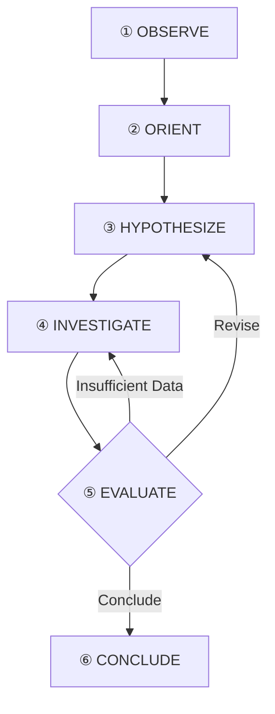
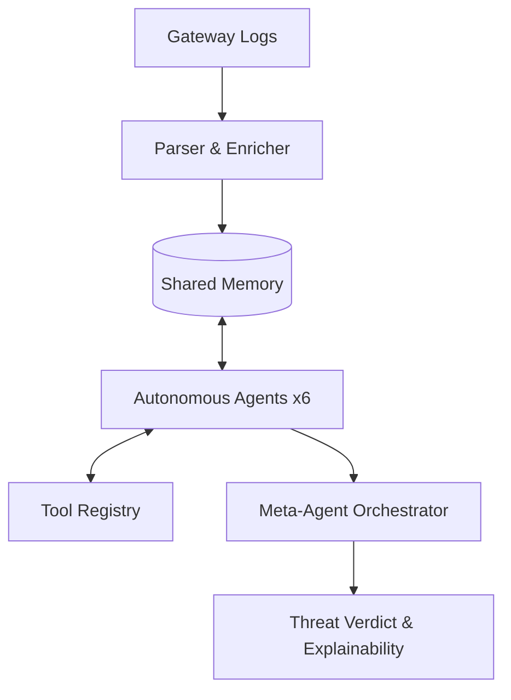

# APISentry: Minimized Architecture Design

> **Goal:** Zero-integration, log-only API abuse detection using autonomous agents.  
> **Core Concept:** True agentic reasoning (OODA loop) vs. static ML pipelines.

---

## 1. Core Reasoning Loop
Each agent follows an **OODA-inspired loop**, enabling it to hypothesize, use tools, and revise its findings.

## 2. High-Level Architecture
The system is built on a **Shared Memory** and **Blackboard (Evidence Board)** architecture.

- **Shared Memory:** Tiered storage (Redis STM for sessions, PostgreSQL LTM for baselines).
- **Evidence Board:** A shared space where agents post findings (e.g., "IP is a datacenter") for others to consume.
- **Tool Registry:** Dynamic functions (GeoIP, Stat-tests, Historical Queries) agents invoke as needed.

---

## 3. Autonomous Detection Agents (The Six Core)

| Agent | Mandate | Primary Tools / Indicators |
|---|---|---|
| **🔢 Volume** | Detect DDoS, scraping, and enumeration spikes. | `query_historical_baseline`, request rate deviations (Z-scores). |
| **🔗 Sequence** | Detect BOLA, BFLA, and workflow bypasses. | Markov Chains, sequential ID walks, missing prerequisites. |
| **🔐 Auth** | Detect credential stuffing and token abuse. | `auth_failure_streak`, API key sharing, 3.2% success "signatures". |
| **📦 Payload** | Detect SQLi, XSS, and Traversal in URLs/sizes. | `param_entropy`, regex patterns, response size anomalies. |
| **🌍 Geo-IP** | Detect impossible travel and VPN/Tor usage. | `lookup_geoip`, IP reputation, ASN profiling. |
| **⏰ Temporal** | Detect bot periodicity and off-hours access. | FFT/autocorrelation, KS-tests (human vs bot timing). |

### 3.1 Tool Registry Overview
Agents dynamically call these functions during their `④ INVESTIGATE` step:
- **Data:** `lookup_geoip`, `query_historical_baseline`, `get_session_history`, `query_ip_reputation`.
- **Logic:** `run_statistical_test`, `compute_entropy`, `detect_periodicity`, `calculate_similarity`.
- **Social:** `query_agent`, `post_to_evidence_board`, `read_evidence_board`.

---

## 4. Meta-Agent Orchestrator (Fusion)
The Meta-Agent is an **autonomous coordinator** that resolves conflicts and detects compound signals.

- **Conflict Resolution:** If the Auth agent says "No attack" (low confidence) but the Sequence agent sees BOLA (high confidence), the Meta-Agent escalates to "Authorized User Abuse."
- **Compound Signals:** Detects patterns like `High Volume + Sequential IDs + Bot Timing` → **Scraping Bot**.
- **Fusion Strategy:** Uses XGBoost stacking on agent confidence scores for final verdict.

---

## 5. Implementation Summary

### OWASP API Top 10 Coverage
- **API1 (BOLA):** ✅ Sequence Agent
- **API2 (Broken Auth):** ✅ Auth Agent
- **API4 (Resource Consumption):** ✅ Volume Agent
- **API5/6 (BFLA/Sensitive Flows):** ✅ Sequence Agent
- **API9 (Improper Inventory):** ✅ Sequence Agent

### Data Enrichment (Derived Fields)
- `session_id`: Heuristic stitching (IP + UA + API key).
- `endpoint_template`: Regex-normalized paths (e.g., `/users/{id}`).
- `geo_context`: Datacenter, VPN, and ASN reputation flags.

### Validation Strategy (IEEE Paper)
- **Datasets:** CSIC 2010, CICIDS 2017/2018, UNSW-NB15.
- **Ablation Study:** Prove that **Reasoning Loops + Tool Use + Inter-Agent Communication** outperforms static pipelines.
